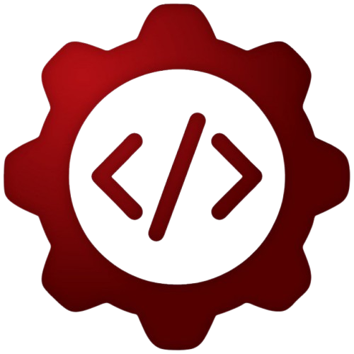

# OS PROGRAMADORES
💣DESAFIOS RESOLVIDOS DO "OS PROGRAMADORES".

  

## CONCEITO:
Este [Repositório](https://github.com/OsProgramadores/op-desafios) contém os desafios feitos pelo `VILHALVA` para o grupo de programação [OsProgramadores](http://t.me/osprogramadores). O site do grupo contém a [lista de desafios](https://osprogramadores.com/desafios/) com descrições individuais de cada um.

## FONTES E SUBSIDIOS:
- [SITE OFICIAL](https://osprogramadores.com/desafios/)
- [REPOSITÓRIO OFICIAL](https://github.com/OsProgramadores/op-desafios)
- [DESAFIOS FEITO PELO VILHALVA](https://github.com/VILHALVA)
- [LINGUAGEM DE PROGRAMAÇÃO](https://github.com/VILHALVA/CURSO-DE-PYTHON)

